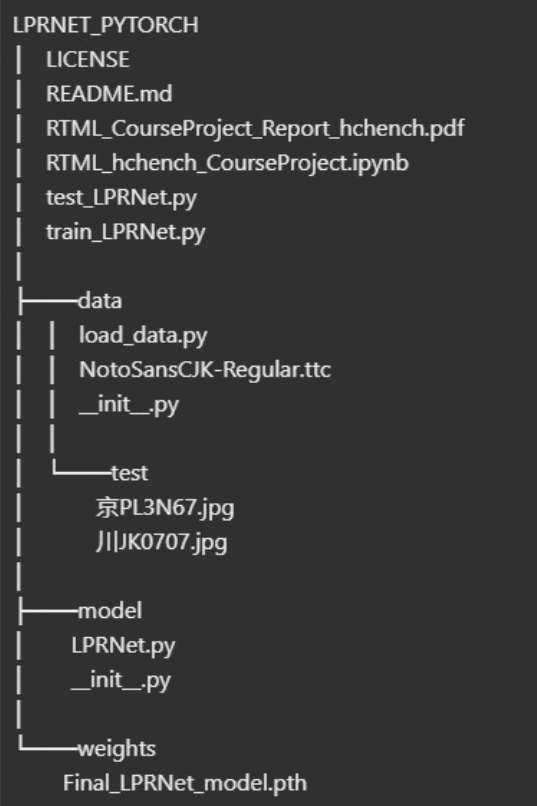

# LPRNet_Pytorch
Pytorch Implementation For LPRNet, A High Performance And Lightweight License Plate Recognition Framework.  
完全适用于中国车牌识别（Chinese License Plate Recognition）及国外车牌识别！  
目前仅支持同时识别蓝牌和绿牌即新能源车牌等中国车牌，但可通过扩展训练数据或微调支持其他类型车牌及提高识别准确率！

# dependencies

- pytorch >= 1.0.0
- opencv-python 3.x
- python 3.x
- imutils
- Pillow
- numpy
- tvm
- onnx

# Folder Structure :



# pretrained model

* [pretrained_model](https://github.com/sirius-ai/LPRNet_Pytorch/tree/master/weights/)

# training and testing

1. prepare your datasets, image size must be 94x24.
2. base on your datsets path modify the scripts its hyperparameters --train_img_dirs or --test_img_dirs.
3. adjust other hyperparameters if need.
4. run 'python train_LPRNet.py' or 'python test_LPRNet.py'.
5. if want to show testing result, add '--show true' or '--show 1' to run command.

# performance

- personal test datasets.
- include blue/green license plate.
- images are very widely.
- total test images number is 27320.

|  size  | personal test imgs(%) | inference@gtx 1060(ms) |
| ------ | --------------------- | ---------------------- |
|  1.7M  |         96.0+         |          0.5-          |


# Model Optimizations and MLC Optimizations

The ```RTML_hchench_CourseProject.ipynb``` is a Jupyter notebook that implements various optimization techniques for the License Plate Recognition (LPRNET) model, including pruning, quantization, parallelization, vectorization, and loop blocking. It provides code for evaluating the impact of these optimizations on the model's accuracy, speed, and size, offering insights into how each technique improves the model's performance and efficiency.

The ```RTML_CourseProject_Report_hchench.pdf``` is a detailed report that discusses the optimizations applied to the LPRNet model and the  MLC optimizations. It focuses on three key metrics—speed, accuracy, and model size—and provides answers to relevant questions, explaining how the optimizations influence these aspects and detailing the overall impact on model performance.

# Steps to Run
 
* [Colab_link](
https://colab.research.google.com/drive/1NVnd2B-PjvBo97PrFe6Fn2zDvapyQSr9?authuser=1#scrollTo=-o38Qyl57E6C)

Open the above colab link and run the cells one by one and to get inference speed, accuracy and size using onnx  for model optimizations and MLC optimizations.


# References

1. [LPRNet: License Plate Recognition via Deep Neural Networks](https://arxiv.org/abs/1806.10447v1)
2. [PyTorch中文文档](https://pytorch-cn.readthedocs.io/zh/latest/)

